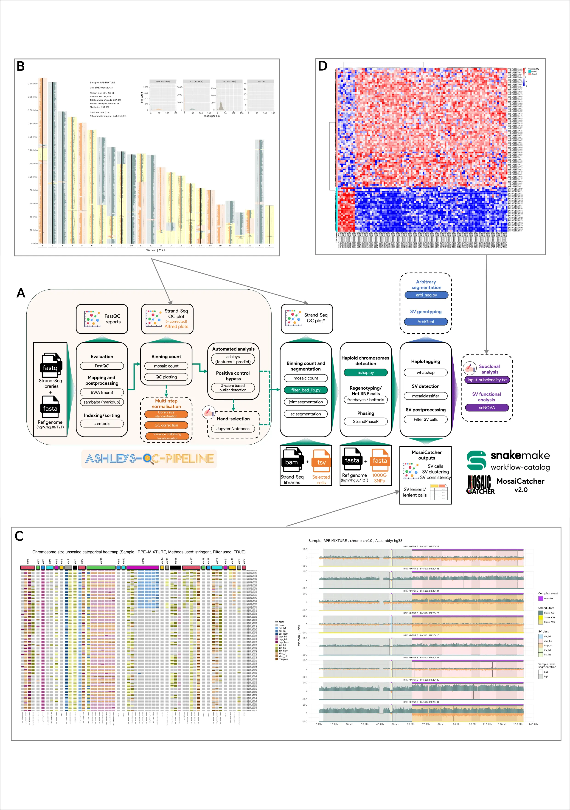

# Overview 

## 🧹 Ashleys-QC Pipeline

This workflow uses [Snakemake](https://github.com/snakemake/snakemake) perform Quality Control analysis on Strand-Seq single-cell
sequencing data. The starting point are single-cell FASTQ files from Strand-seq experiments and the final output produced is a folder with clean selected BAM files. The pipeline can identify automatically high-quality libraries through ML-based analysis tool [ashleys-qc](https://github.com/friendsofstrandseq/ashleys-qc). Thus, the workflow goes through the following steps:

1. FASTQ sequencing Quality Control through [FastQC](https://www.bioinformatics.babraham.ac.uk/projects/fastqc/)
2. Mapping FASTQ against a reference genome throught [BWA](http://bio-bwa.sourceforge.net/)
3. Sorting, Deduplicating and Indexing of BAM files through [Samtools](http://www.htslib.org/) & [sambaba](https://lomereiter.github.io/sambamba/docs/sambamba-view.html)
4. Generating features and use [ashleys-qc](https://github.com/friendsofstrandseq/ashleys-qc) model to identify high-quality cells

## 🧩 MosaiCatcher

The starting point in MosaiCatcher are single-cell
BAM files from Strand-seq experiments and the final output are SV predictions in
a tabular format as well as in a graphical representation. To get to this point,
the workflow goes through the following steps:

1. Binning of sequencing reads in genomic windows of 200kb via [mosaic](https://github.com/friendsofstrandseq/mosaicatcher)
2. Strand state detection
3. [Optional] Normalization of coverage with respect to a reference sample
4. Multi-variate segmentation of cells ([mosaic](https://github.com/friendsofstrandseq/mosaicatcher))
5. Haplotype resolution via [StrandPhaseR](https://github.com/daewoooo/StrandPhaseR)
6. Bayesian classification of segmentation to find SVs using MosaiClassifier
7. Visualization of results using custom R plots

??? note "Figure 1: MosaiCatcher v2 schematic representation and visualizations examples."

    MosaiCatcher v2 schematic representation and visualizations examples. (A) MosaiCatcher v2 pipeline schematic representation: On the left part in dimmed orange is represented ashleys-qc-pipeline, a switchable preprocessing optional module that allows to perform standard steps of mapping, sorting, and indexing FASTQ libraries, producing quality control plots and reports as well as identifying high-quality libraries. On the right uncolored part, the MosaiCatcher core part of the pipeline is still usable as a standalone by providing Stand-Seq aligned BAM files. Green boxes correspond to data-conditional dependent execution steps (Snakemake checkpoints) that allow more flexibility and reduce issues when executing the workflow. Orange box corresponds to the multi-step normalization module. Blue box corresponds to ArbiGent mode of execution that allows SV genotyping from arbitrary segmentation. Violet box corresponds to scNOVA SV function analysis mode of execution. Dashed boxes correspond to optional modules. *: Strand-seq QC plot is only produced here if ashleys-qc pipeline is not enabled (B) quality control Strand-seq karyotype visualization based on read counting according to a defined window (here 200 kb). A karyotype plot is available for each single-cell sequenced. Additional statistics are also presented in the upper part of the figure. These plots allow the users to perform QC to assess sequencing integrity. (C) SV call clustering heatmap and chromosome-wise visualizations. The clustering heatmap on the left generates a global SV distribution representation of the sample. Each SV call is represented as a column and each library as a row. Top row annotation corresponds to chromosomes and individual heatmap cell color corresponds to a specific type of haplotype-phased SV defined in the legend. The chromosome-wise representation on the right side of the subfigure summarizes, for a given chromosome (here chr10), the different layers of information computed during the pipeline: binned read counts, joint and cell segmentation, and phased SV calls. (D) Differential nucleosome occupancy heatmap representation: this heatmap computed with the scNOVA downstream module exemplifies gene-body-based differential nucleosome occupancy profiles (Jeong et al. 2023).

## 📆 Roadmap

### Technical-related features

- [x] Zenodo automatic download of external files + indexes ([1.2.1](https://github.com/friendsofstrandseq/mosaicatcher-pipeline/releases/tag/1.2.1))
- [x] Multiple samples in the parent folder ([1.2.2](https://github.com/friendsofstrandseq/mosaicatcher-pipeline/releases/tag/1.2.2))
- [x] Automatic testing of BAM SM tag compared to sample folder name ([1.2.3](https://github.com/friendsofstrandseq/mosaicatcher-pipeline/releases/tag/1.2.3))
- [x] On-error/success e-mail ([1.3](https://github.com/friendsofstrandseq/mosaicatcher-pipeline/releases/tag/1.3))
- [x] HPC execution (slurm profile for the moment) ([1.3](https://github.com/friendsofstrandseq/mosaicatcher-pipeline/releases/tag/1.3))
- [x] Full singularity image with preinstalled conda envs ([1.5.1](https://github.com/friendsofstrandseq/mosaicatcher-pipeline/releases/tag/1.5.1))
- [x] Single BAM folder with side config file ([1.6.1](https://github.com/friendsofstrandseq/mosaicatcher-pipeline/releases/tag/1.6.1))
- [x] (EMBL) GeneCore mode of execution: allow selection and execution directly by specifying genecore run folder (2022-11-02-H372MAFX5 for instance) ([1.8.2](https://github.com/friendsofstrandseq/mosaicatcher-pipeline/releases/tag/1.8.2))
- [x] Version synchronisation between ashleys-qc-pipeline and mosaicatcher-pipeline ([1.8.3](https://github.com/friendsofstrandseq/mosaicatcher-pipeline/releases/tag/1.8.3))
- [x] Report captions update ([1.8.5](https://github.com/friendsofstrandseq/mosaicatcher-pipeline/releases/tag/1.8.5))
- [x] Clustering plot (heatmap) & SV calls plot update ([1.8.6](https://github.com/friendsofstrandseq/mosaicatcher-pipeline/releases/tag/1.8.6))
- [x] [`ashleys_pipeline_only` parameter](/docs/usage.md#usage): using mosaicatcher-pipeline, trigger ashleys-qc-pipeline only and will stop after the generation of the counts, ashleys predictions & plots to allow the user manual reviewing/selection of the cells to be processed ([2.2.0](https://github.com/friendsofstrandseq/mosaicatcher-pipeline/releases/tag/2.2.0))
- [x] Target alternative execution ending: `breakpointr_only` parameter to stop the execution after breakpointR ; `whatshap_only` parameter to stop the execution after whatshap ([2.3.3](https://github.com/friendsofstrandseq/mosaicatcher-pipeline/releases/tag/2.3.3))
- [ ] Plotting options (enable/disable segmentation back colors)

### Bioinformatic-related features

- [x] Self-handling of low-coverage cells ([1.6.1](https://github.com/friendsofstrandseq/mosaicatcher-pipeline/releases/tag/1.6.1))
- [x] Upstream [ashleys-qc-pipeline](https://github.com/friendsofstrandseq/ashleys-qc-pipeline.git) and FASTQ handle ([1.6.1](https://github.com/friendsofstrandseq/mosaicatcher-pipeline/releases/tag/1.6.1))
- [x] Change of reference genome (currently only GRCh38) ([1.7.0](https://github.com/friendsofstrandseq/mosaicatcher-pipeline/releases/tag/1.7.0))
- [x] Ploidy detection at the segment and the chromosome level: used to bypass StrandPhaseR if more than half of a chromosome is haploid ([1.7.0](https://github.com/friendsofstrandseq/mosaicatcher-pipeline/releases/tag/1.7.0))
- [x] inpub_bam_legacy mode (bam/selected folders) ([1.8.4](https://github.com/friendsofstrandseq/mosaicatcher-pipeline/releases/tag/1.8.4))
- [x] Blacklist regions files for T2T & hg19 ([1.8.5](https://github.com/friendsofstrandseq/mosaicatcher-pipeline/releases/tag/1.8.5))
- [x] [ArbiGent](/docs/usage.md#arbigent-mode-of-execution) integration: Strand-Seq based genotyper to study SV containly at least 500bp of uniquely mappable sequence ([1.9.0](https://github.com/friendsofstrandseq/mosaicatcher-pipeline/releases/tag/1.9.0))
- [x] [scNOVA](/docs/usage.md#scnova-mode-of-execution) integration: Strand-Seq Single-Cell Nucleosome Occupancy and genetic Variation Analysis ([1.9.2](https://github.com/friendsofstrandseq/mosaicatcher-pipeline/releases/tag/1.9.2))
- [x] [`multistep_normalisation` and `multistep_normalisation_for_SV_calling` parameters](/docs/usage.md#multistep-normalisation) to replace GC analysis module (library size normalisation, GC correction, Variance Stabilising Transformation) ([2.1.1](https://github.com/friendsofstrandseq/mosaicatcher-pipeline/releases/tag/2.1.1))
- [x] Strand-Seq processing based on mm10 assembly ([2.1.2](https://github.com/friendsofstrandseq/mosaicatcher-pipeline/releases/tag/2.1.2))
- [x] UCSC ready to use file generation including counts & SV calls ([2.1.2](https://github.com/friendsofstrandseq/mosaicatcher-pipeline/releases/tag/2.1.2))
- [x] `blacklist_regions` parameter: ([2.2.0](https://github.com/friendsofstrandseq/mosaicatcher-pipeline/releases/tag/2.2.0))
- [x] IGV ready to use XML session generation: ([2.2.2](https://github.com/friendsofstrandseq/mosaicatcher-pipeline/releases/tag/2.2.2))
- [x] BreakpointR integration through `breakpointr` parameter ([2.3.3](https://github.com/friendsofstrandseq/mosaicatcher-pipeline/releases/tag/2.3.3))
- [ ] Pooled samples

### Small issues to fix

- [x] replace `input_bam_location` by `data_location` (harmonization with [ashleys-qc-pipeline](https://github.com/friendsofstrandseq/ashleys-qc-pipeline.git))
- [x] List of commands available through list_commands parameter ([1.8.6](https://github.com/friendsofstrandseq/mosaicatcher-pipeline/releases/tag/1.8.6)
- [x] Move pysam / SM tag comparison script to snakemake rule ([2.2.0](https://github.com/friendsofstrandseq/mosaicatcher-pipeline/releases/tag/2.2.0))

## 🛑 Troubleshooting & Current limitations

- Do not change the structure of your input folder after running the pipeline, first execution will build a config dataframe file (`OUTPUT_DIRECTORY/config/config.tsv`) that contains the list of cells and the associated paths
- Do not change the list of chromosomes after a first execution (i.e: first execution on `chr17`, second execution on all chromosomes)

## 💂‍♂️ Authors (alphabetical order)

- Ashraf Hufash
- Cosenza Marco
- Ebert Peter
- Ghareghani Maryam
- Grimes Karen
- Gros Christina
- Höps Wolfram
- Jeong Hyobin
- Kinanen Venla
- Korbel Jan
- Marschall Tobias
- Meiers Sasha
- Porubsky David
- Rausch Tobias
- Sanders Ashley
- Van Vliet Alex
- Weber Thomas (maintainer and current developer)

## Citing MosaiCatcher

When using MosaiCatcher for a publication, please **cite the following article** in your paper:

[MosaiCatcher v2 publication: Weber Thomas, Marco Raffaele Cosenza, and Jan Korbel. 2023. ‘MosaiCatcher v2: A Single-Cell Structural Variations Detection and Analysis Reference Framework Based on Strand-Seq’. Bioinformatics 39 (11): btad633. https://doi.org/10.1093/bioinformatics/btad633.](https://doi.org/10.1093/bioinformatics/btad633)

## 📕 References

> MosaiCatcher v2 publication: Weber Thomas, Marco Raffaele Cosenza, and Jan Korbel. 2023. ‘MosaiCatcher v2: A Single-Cell Structural Variations Detection and Analysis Reference Framework Based on Strand-Seq’. Bioinformatics 39 (11): btad633. [https://doi.org/10.1093/bioinformatics/btad633](https://doi.org/10.1093/bioinformatics/btad633)

> Strand-seq publication: Falconer, E., Hills, M., Naumann, U. et al. DNA template strand sequencing of single-cells maps genomic rearrangements at high resolution. Nat Methods 9, 1107–1112 (2012). [https://doi.org/10.1038/nmeth.2206](https://doi.org/10.1038/nmeth.2206)

> scTRIP/MosaiCatcher original publication: Sanders, A.D., Meiers, S., Ghareghani, M. et al. Single-cell analysis of structural variations and complex rearrangements with tri-channel processing. Nat Biotechnol 38, 343–354 (2020). [https://doi.org/10.1038/s41587-019-0366-x](https://doi.org/10.1038/s41587-019-0366-x)

> ArbiGent publication: Porubsky, David, Wolfram Höps, Hufsah Ashraf, PingHsun Hsieh, Bernardo Rodriguez-Martin, Feyza Yilmaz, Jana Ebler, et al. 2022. “Recurrent Inversion Polymorphisms in Humans Associate with Genetic Instability and Genomic Disorders.” Cell 185 (11): 1986-2005.e26. [https://doi.org/10.1016/j.cell.2022.04.017](https://doi.org/10.1016/j.cell.2022.04.017)

> scNOVA publication: Jeong, Hyobin, Karen Grimes, Kerstin K. Rauwolf, Peter-Martin Bruch, Tobias Rausch, Patrick Hasenfeld, Eva Benito, et al. 2022. “Functional Analysis of Structural Variants in Single Cells Using Strand-Seq.” Nature Biotechnology, November, 1–13. [https://doi.org/10.1038/s41587-022-01551-4](https://doi.org/10.1038/s41587-022-01551-4)
