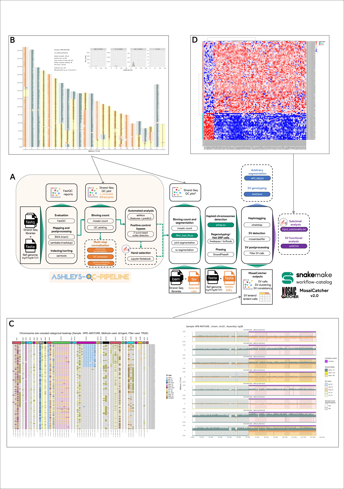

---
hide:
  - toc
  - navigation
---

# MosaiCatcher-pipeline

MosaiCatcher-pipeline is a [Snakemake](https://github.com/snakemake/snakemake)-based workflow for detecting somatic structural variants (SVs) in single-cell [Strand-seq](https://doi.org/10.1038/nmeth.2206) data. It takes either raw FASTQ files or pre-aligned BAM files as input and produces haplotype-resolved SV calls, interactive visualizations, and quality control reports.

**From FASTQ *(optional)*:**

- FASTQ quality control via FastQC / MultiQC
- Alignment to reference genome (hg38, hg19, T2T, mm10, mm39) with BWA
- BAM sorting, deduplication, and indexing
- ML-based cell quality classification with ashleys-qc

**Core pipeline:**

- Strand-specific read binning in genomic windows (default 200 kb)
- Strand state detection and optional coverage normalization
- Multi-variate joint segmentation across all cells
- Haplotype resolution with StrandPhaseR
- Bayesian SV classification with MosaiClassifier
- Visualization: karyotype plots, clustering heatmaps, chromosome views

??? note "Figure 1: MosaiCatcher v2 schematic representation and visualization examples."

    MosaiCatcher v2 schematic representation and visualizations examples. (A) MosaiCatcher v2 pipeline schematic representation: On the left part in dimmed orange is represented ashleys-qc-pipeline, a switchable preprocessing optional module that allows to perform standard steps of mapping, sorting, and indexing FASTQ libraries, producing quality control plots and reports as well as identifying high-quality libraries. On the right uncolored part, the MosaiCatcher core part of the pipeline is still usable as a standalone by providing Strand-Seq aligned BAM files. Green boxes correspond to data-conditional dependent execution steps (Snakemake checkpoints) that allow more flexibility and reduce issues when executing the workflow. Orange box corresponds to the multi-step normalization module. Blue box corresponds to ArbiGent mode of execution that allows SV genotyping from arbitrary segmentation. Violet box corresponds to scNOVA SV function analysis mode of execution. Dashed boxes correspond to optional modules. (B) Quality control Strand-seq karyotype visualization based on read counting. (C) SV call clustering heatmap and chromosome-wise visualizations. (D) Differential nucleosome occupancy heatmap representation computed with the scNOVA downstream module.

---

## Documentation

-   📦 **[Installation](installation.md)**

    ---

    Install Snakemake via Pixi or conda, clone the repository, set up Apptainer

-   🚀 **[Quick Start](quickstart.md)**

    ---

    Run the pipeline on example data with a single command

-   ▶️ **[Usage](usage.md)**

    ---

    Local and HPC execution, SLURM profiles, memory handling

-   ⚙️ **[Parameters](parameters.md)**

    ---

    Full reference for all configuration options

-   🧬 **[Reference Genomes](reference-genomes.md)**

    ---

    Supported assemblies, assembly-specific containers, mm39 caveats

-   🔬 **[Advanced Modes](advanced-modes.md)**

    ---

    ArbiGent, scNOVA, BreakpointR, multistep normalisation

-   📊 **[Outputs](outputs.md)**

    ---

    Output files, plots, and report formats

-   🛠️ **[Troubleshooting](troubleshooting.md)**

    ---

    Common issues and solutions

---

## Authors (alphabetical order)

- Ashraf Hufash
- Cosenza Marco
- Ebert Peter
- Ghareghani Maryam
- Grimes Karen
- Gros Christina
- Höps Wolfram
- Jeong Hyobin
- Kinanen Venla
- Korbel Jan
- Marschall Tobias
- Meiers Sasha
- Porubsky David
- Rausch Tobias
- Sanders Ashley
- Van Vliet Alex
- Weber Thomas (maintainer and current developer)

## Citing MosaiCatcher

When using MosaiCatcher for a publication, please **cite the following article**:

[Weber Thomas, Marco Raffaele Cosenza, and Jan Korbel. 2023. 'MosaiCatcher v2: A Single-Cell Structural Variations Detection and Analysis Reference Framework Based on Strand-Seq'. *Bioinformatics* 39 (11): btad633.](https://doi.org/10.1093/bioinformatics/btad633)

## References

> Strand-seq: Falconer, E., Hills, M., Naumann, U. et al. DNA template strand sequencing of single-cells maps genomic rearrangements at high resolution. *Nat Methods* 9, 1107–1112 (2012). [https://doi.org/10.1038/nmeth.2206](https://doi.org/10.1038/nmeth.2206)

> scTRIP/MosaiCatcher original: Sanders, A.D., Meiers, S., Ghareghani, M. et al. Single-cell analysis of structural variations and complex rearrangements with tri-channel processing. *Nat Biotechnol* 38, 343–354 (2020). [https://doi.org/10.1038/s41587-019-0366-x](https://doi.org/10.1038/s41587-019-0366-x)

> ArbiGent: Porubsky, David, et al. Recurrent Inversion Polymorphisms in Humans Associate with Genetic Instability and Genomic Disorders. *Cell* 185 (11): 1986-2005.e26 (2022). [https://doi.org/10.1016/j.cell.2022.04.017](https://doi.org/10.1016/j.cell.2022.04.017)

> scNOVA: Jeong, Hyobin, et al. Functional Analysis of Structural Variants in Single Cells Using Strand-Seq. *Nature Biotechnology* (2022). [https://doi.org/10.1038/s41587-022-01551-4](https://doi.org/10.1038/s41587-022-01551-4)
